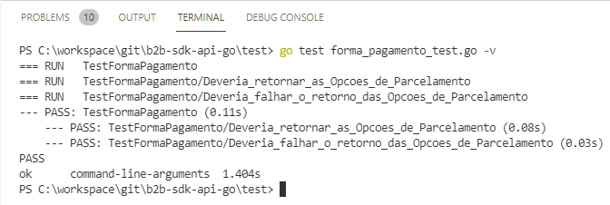

# SDK golang para API B2B

Provê os componentes em go para o uso da API B2B, disponibilizado pela VIA, facilitando a integração com as documentações relacionadas:

## Documentação Swagger

| Swagger |
| ------ | 
| http://api-integracao-pontofrio.hlg-b2b.net/swagger/ui/index#/ |
| http://api-integracao-casasbahia.hlg-b2b.net/swagger/ui/index#/| 
| http://api-integracao-extra.hlg-b2b.net/swagger/ui/index#/ |

## Configurando o ambiente

Instalar:

- Para isso, no site da linguagem (https://golang.org/), há um link de download (https://golang.org/dl/).
  Então, basta fazer o download e instalar a última versão da linguagem para o seu sistema operacional.

## Configurando o SDK
 Dentro da pasta ./test se encontra o arquivo de configurações (.env.example), renomear para .env e configurar as duas propriedades: 
 - HOST_BANDEIRA  (end-point utilizado de homologação do Via varejo B2B).
 - TOKEN_PARCEIRO (token de acesso do parceiro).
 
## Estrutura do projeto
 A estrutura de pastas do projeto é composto pela pasta [src] e pela pasta [test] onde encontra-se os arquivos de teste das api, e servirão de exemplo de como consumir as api's.

## Arquivos de funções que representam as 5 URI das APIs disponíveis

Na pasta [src / api] contem os arquivos:
* campanha_api.go
* forma_pagamento_api.go
* pedido_api.go
* produto_api.go
* seguranca_api.go

Esses arquivos compõem a camada de acesso para os serviços disponibilizados pelo B2B, exemplos de como utiliza-las estão disponíveis nos arquivos de testes.

## Arquivos struct DTO

Na pasta [src / model] estão os arquivos com as struct's que auxiliam nos requests e responses das chamadas da api.

## Arquivo de função para a criptografia

Na pasta [src / security]  esta o arquivo de criptografia para os dados do cartão de crédito, eles devem ser criptografados pelo parceiro. A encriptação deverá ser do tipo RSA2048 (RSA2048 PKCS1-UTF8) e deverá utilizar uma chave pública fornecida pela Via Varejo, no Swagger, GET /seguranca/chaves.

## Arquivo de função client de comunicação com Api's

Na pasta [src / service] está o arquivo rest.go responsável por fazer a comunicação com a Api.

A seguir, são apresentadas as 5 APIs e exemplos com as principais operações do B2B.

- ## Campanha
    Api Utilizada para operações de campanha.
    Os testes unitários estão disponiveis no arquivo test/campanha-test.go.
    Esses testes servirão como exemplo de utilização da api.

    | Obtém todas as campanhas vinculadas ao parceiro: |
    | ------ | 
    | http://api-integracao-casasbahia.hlg-b2b.net/swagger/ui/index#/Campanha/Campanha_ListarCampanhaAsync |
    | http://api-integracao-pontofrio.hlg-b2b.net/swagger/ui/index#/Campanha/Campanha_ListarCampanhaAsync |
    | http://api-integracao-extra.hlg-b2b.net/swagger/ui/index#/Campanha/Campanha_ListarCampanhaAsync |

    | Obtém todas as opções de pagamento para uma determinada campanha: |
    | ------ | 
    | http://api-integracao-casasbahia.hlg-b2b.net/swagger/ui/index#!/Campanha/Campanha_ListarOpcoesParcelamentoAsync |
    | http://api-integracao-pontofrio.hlg-b2b.net/swagger/ui/index#/Campanha/Campanha_ListarOpcoesParcelamentoAsync |
    | http://api-integracao-extra.hlg-b2b.net/swagger/ui/index#/Campanha/Campanha_ListarOpcoesParcelamentoAsync |
    
***

- ## Pedido
    Api utilizada para operações de pedidos.
    Os testes unitários estão disponiveis no arquivo test/pedido-test.go.
    Esses testes servirão como exemplo de utilização da api.
    ### observação
    As constantes do arquivo menionado acima ID_SKU_CRIACAO_PEDIDO, ID_SKU_CRIACAO_PEDIDO_COM_CARTAO, ID_CAMPANHA, ID_LOJISTA e CEP podem mudar dependendo de quando forem testar.
    Existe uma dependência entre os testes, pois a massa de dados é criado em tempo de execução do teste.

    | Calcular carrinho: |
    | ------ | 
    | http://api-integracao-casasbahia.hlg-b2b.net/swagger/ui/index#!/Pedido/Pedido_CalcularCarrinhoAsync |
    | http://api-integracao-pontofrio.hlg-b2b.net/swagger/ui/index#!/Pedido/Pedido_CalcularCarrinhoAsync |
    | http://api-integracao-extra.hlg-b2b.net/swagger/ui/index#!/Pedido/Pedido_CalcularCarrinhoAsync |
		
    | Obter os dados de pedido do parceiro: |
    | ------ | 
    | http://api-integracao-casasbahia.hlg-b2b.net/swagger/ui/index#!/Pedido/Pedido_ObterPedidoAsync|
    | http://api-integracao-pontofrio.hlg-b2b.net/swagger/ui/index#!/Pedido/Pedido_ObterPedidoAsync|
    | http://api-integracao-extra.hlg-b2b.net/swagger/ui/index#!/Pedido/Pedido_ObterPedidoAsync|
	 
    | Confirma ou cancela pedidos pendentes de confirmação: |
    | ------ | 
    | http://api-integracao-casasbahia.hlg-b2b.net/swagger/ui/index#!/Pedido/Pedido_ConfirmarPedidoAsync|
    | http://api-integracao-pontofrio.hlg-b2b.net/swagger/ui/index#!/Pedido/Pedido_ConfirmarPedidoAsync|
    | http://api-integracao-extra.hlg-b2b.net/swagger/ui/index#!/Pedido/Pedido_ConfirmarPedidoAsync|
	
    | Obter nota fiscal do pedido: |
    | ------ | 
    | http://api-integracao-casasbahia.hlg-b2b.net/swagger/ui/index#!/Pedido/Pedido_ObterNFeAsync|
    | http://api-integracao-pontofrio.hlg-b2b.net/swagger/ui/index#!/Pedido/Pedido_ObterNFeAsync|
    | http://api-integracao-extra.hlg-b2b.net/swagger/ui/index#!/Pedido/Pedido_ObterNFeAsync|
		
    | Criar pedido: |
    | ------ | 
    | http://api-integracao-casasbahia.hlg-b2b.net/swagger/ui/index#!/Pedido/Pedido_ObterNFeAsync|
    | http://api-integracao-pontofrio.hlg-b2b.net/swagger/ui/index#!/Pedido/Pedido_ObterNFeAsync|
    | http://api-integracao-extra.hlg-b2b.net/swagger/ui/index#!/Pedido/Pedido_ObterNFeAsync|

***

- ## Forma de Pagamento
    Api Utilizada para operações de forma de pagamento.
    Os testes unitários estão disponiveis no arquivo test/forma-pagamento-test.go.
    Esses testes servirão como exemplo de utilização da api.

    | Obter opções de parcelamento: |
    | ------ |
    | http://api-integracao-casasbahia.hlg-b2b.net/swagger/ui/index#!/FormaPagamento/FormaPagamento_ListarOpcoesParcelamentoAsync |
    | http://api-integracao-pontofrio.hlg-b2b.net/swagger/ui/index#!/FormaPagamento/FormaPagamento_ListarOpcoesParcelamentoAsync |
    | http://api-integracao-extra.hlg-b2b.net/swagger/ui/index#!/FormaPagamento/FormaPagamento_ListarOpcoesParcelamentoAsync |

***

- ## Produto
    Api Utilizada para operações de produto.
    Os testes unitários estão disponiveis no arquivo test/produto-test.go.
    Esses testes servirão como exemplo de utilização da api.

    | Obter dados do produto: |
    | ------ |
    | http://api-integracao-casasbahia.hlg-b2b.net/swagger/ui/index#!/Produto/Produto_ObterProdutoAsync|
    | http://api-integracao-pontofrio.hlg-b2b.net/swagger/ui/index#!/Produto/Produto_ObterProdutoAsync|
    | http://api-integracao-extra.hlg-b2b.net/swagger/ui/index#!/Produto/Produto_ObterProdutoAsync|
    
    |# Obter lista de dados dos produtos: |
    | ------ |
    | http://api-integracao-casasbahia.hlg-b2b.net/swagger/ui/index#!/Produto/Produto_ListarProdutoAsync|
    | http://api-integracao-pontofrio.hlg-b2b.net/swagger/ui/index#!/Produto/Produto_ListarProdutoAsync|
    | http://api-integracao-extra.hlg-b2b.net/swagger/ui/index#!/Produto/Produto_ListarProdutoAsync|

    | Obter dados do produto por Campanha: |
    | ------ |
    | http://api-integracao-casasbahia.hlg-b2b.net/swagger/ui/index#!/Produto/Produto_ObterProdutoPorCampanhaAsync |
    | http://api-integracao-pontofrio.hlg-b2b.net/swagger/ui/index#!/Produto/Produto_ObterProdutoPorCampanhaAsync |
    | http://api-integracao-extra.hlg-b2b.net/swagger/ui/index#!/Produto/Produto_ObterProdutoPorCampanhaAsync |

***

- ## Seguranca
    Api Utilizada para operações de seguranca.
    Os testes unitários estão disponiveis no arquivo test/seguranca-test.go.
    Esses testes servirão como exemplo de utilização da api.

    | Obter chave pública 2048 bits utilizada para criptografia dos dados do cartão: |
    | ------ |
    | http://api-integracao-casasbahia.hlg-b2b.net/swagger/ui/index#!/Seguranca/Seguranca_ObterChave|
    | http://api-integracao-pontofrio.hlg-b2b.net/swagger/ui/index#!/Seguranca/Seguranca_ObterChave|
    | http://api-integracao-extra.hlg-b2b.net/swagger/ui/index#!/Seguranca/Seguranca_ObterChave|

***

## Testes unitarios

 Foram criados na pasta [ test ] um arquivo específico para cada uma das 5 API's do B2B, nesses arquivos você encontrará exemplos de como consumir os serviços oferecidos.

Na pasta [tests] contem os arquivos:
* campanha_test.go
* forma_pagamento_test.go
* pedido_test.go
* produto_test.go
* seguranca_test.go
* encrypto_test.go (arquivo adicional)

* Para fazer teste de arquivo individual:
>`go test test/forma_pagamento_test.go -v`

* Teste geral:
>`go test ./test -v`

